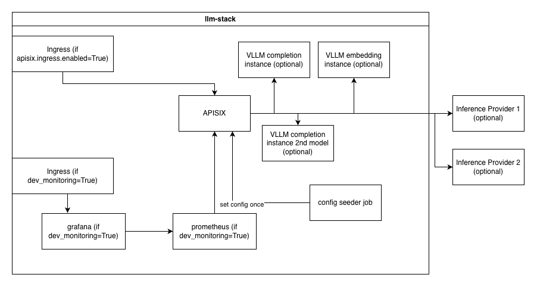

# LLM Stack
A helm chart for a self-hosted llm stack featuring:

* Apisix as the AI gateway
  * with configurable routes to a mix of locally hosted or 3rd party provided LLM and embedding models
* Optional prometheus and grafana components for local development
* values.yaml files and basic request scripts for local development in `examples/` and `bin/`



The main feature is the ability to configure routes like the following while having key-based auth and spending limits 
for multiple consumers across these different providers: 

```yaml
apisixConfig:
  routes:
    scalewayCompletion:
      type: completion
      provider: scaleway
      providerFormat: openai-compatible
      apiKeySecretKey: scaleway_api_key
      # retrieve the project id from the scaleway project dashboard
      baseURL: "https://api.scaleway.ai/<project_id>/v1/chat/completions"
      models:   # model whitelist 
        - name: qwen3.6-35b-a3b
        - name: gemma-4-26b-a4b-it
        - name: glm-5.2
        - name: deepseek-v4-flash-0731
        - name: qwen3.5-397b-a17b
        - name: mistral-medium-3.5-128b
    scalewayEmbedding:
      type: embedding
      provider: scaleway
      providerFormat: openai-compatible
      apiKeySecretKey: scaleway_api_key
      baseURL: "https://api.scaleway.ai/<project_id>/v1/embeddings"
      models:
        - name: qwen3-embedding-8b
        - name: bge-multilingual-gemma2
    selfHostedEmbedding:
      type: embedding
      provider: selfHosted # means hosted using vllm
      providerFormat: openai-compatible
      vllmConfigId: embeddingHarrier
      models:
        - name: harrier-270
```

## Local Development

### Minimum requirements for local vllm
* 24gb RAM

### Creating the cluster

```bash
k3d cluster create llm-stack-dev --port "80:80@loadbalancer"
kubectl create namespace llm-stack
```

### Creating the Apisix Secrets

**Creating the Apisix initial config secret:**
```bash
kubectl create secret generic llm-stack-apisix-initial-config-secret --from-literal=provider_api_key='abc' --from-literal=consumers='[{"name": "consumerA", "key": "sk-client-v1-abcdef123456"}]' -n llm-stack
```
* `provider_api_key` is the key of a provider you are forwarding the requests to, e.g. scaleway. These keys are referenced in your values.yaml
* `consumers` is a stringified json array of consumers

**Updating the Apisix initial config secret**

To add a consumer or provider, this is closest to the original creation:
```bash
kubectl patch secret llm-stack-apisix-initial-config-secret --patch "$(kubectl create secret generic llm-stack-apisix-initial-config-secret --from-literal=provider_api_key='abc' --from-literal=scaleway_api_key='xyz' --from-literal=consumers='[{"name": "consumerA", "key": "sk-client-v1-abcdef123456"}, {"name": "def", "key": "abc"}]' --dry-run=client -o json )" -n llm-stack
```

**Creating the apisix admin API:**
```bash
kubectl create secret generic llm-stack-apisix-admin-secret --from-literal=admin='abc' --from-literal=viewer='def' -n llm-stack
```

* `admin` is the admin key for editing
* `viewer` is the admin key for viewing only

### Installing the chart

#### With cpu-based VLLM and a tiny model enabled

```bash
helm install dev-release . -f examples/local-vllm-cpu.yaml -n llm-stack
```
Wait for the vllm liveness probe to start (~4 min) and make a test request:
```bash
export LLM_STACK_MODEL=Qwen/Qwen2.5-0.5B-Instruct
bash bin/test-request-llm-gen.sh
export LLM_STACK_EMBEDDING_MODEL="harrier-270"
bash bin/test-request-embed.sh
```

#### Using scaleway instead of vllm

Adjust the scaleway project id in the `apisixInitialConfig.base_url` in `examples/scaleway.yaml` with your own credentials.

```bash
helm install dev-release . -f examples/scaleway.yaml -n llm-stack
```

```bash
bash bin/test-request-llm-gen.sh
bash bin/test-request-embed.sh
```

#### Combining scaleway and vllm

The example provides one LLM model and embedding model from scaleway and a locally hosted embedding model.
Adjust the scaleway project id in the `apisixInitialConfig.base_url` in `examples/scaleway-vllm-combined.yaml` with your own credentials.

```bash
helm install dev-release . -f examples/scaleway-vllm-combined.yaml -n llm-stack
```

```bash
bash bin/test-request-llm-gen.sh
bash bin/test-request-embed.sh
export LLM_STACK_EMBEDDING_MODEL="harrier-270"
bash bin/test-request-embed.sh
```

### Observability

#### Grafana

Log into grafana at http://grafana.localhost using the default credentials (username: admin, password: admin)

##### Useful queries:

Successful requests for apisix grouped by consumer at 1 min interval:
```promql
sum(increase(apisix_http_status{code=~"[2].."}[1m])) by (consumer)
```

Failing requests for apisix grouped by consumer at 1 min interval:
```promql
sum(increase(apisix_http_status{code=~"[45].."}[1m])) by (consumer)
```

Number of requests for apisix on across all generation models and endpoints
```promql
sum(increase(apisix_http_status{matched_uri="/v1/chat/completions"}[1m])) by (consumer)
```

Number of requests for apisix on across all embedding models and endpoints
```promql
sum(increase(apisix_http_status{matched_uri="/v1/embeddings"}[1m])) by (consumer)
```

Triggerings of ai-loop-guard
```promql
sum(increase(apisix_ai_loop_guard_trigger_count[1m])) by (consumer)
```

Byte lengths of the loops detected by ai loop guard 
```promql
sum(increase(apisix_ai_loop_guard_detected_period_bucket[1m])) by (le)
```